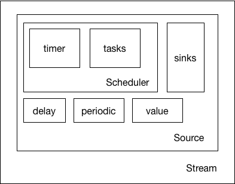

# 如何构建一个stream
在读这篇文档之前，读者应该已经能够掌握响应式编程的基本的使用技巧：知道如何创建一个流（stream），并且会用`map`函数将一个流映射为一个新的流，并且能够使用`observe`函数观察并处理流发射出的事件信息。

以上的应用可以用下面一段简单的代码概括：
```javascript
Praan.periodic(1000, 1)
    .map(data => data + 1)
    .observe(console.info)
```

`Praan`的开发过程也是从实现以上这一小段代码入手的。这三行代码每一行分别实现了三个功能：

- 创建一个新的stream
- 利用`map`映射一个新的流
- 利用`observe`（或者`subscribe`）观察流发射出的事件

第三项是最复杂的，下面我们依次讲起。

## 创建一个stream
要创建一个stream，需要知道stream对象涵盖的方法和属性。这是一个引人深思的问题，设想现实生活中洗手间的一条水管，包含哪些属性呢？

- 首先是水管，无论是铁质的还是PV的，我们首先需要一个水管容器；
- 然后是水，水管需要有流淌的实体
- 最后是水源，不同的水源供水习惯不一样。并且，水源负责供水。

这样，可以粗略的构建个`Stream`类。
```javascript
function Stream(source){   //Stream就是水管，只是个容器而已
    this.source = source;
}
function Source(law, water){   //水源
    this.law = law;           // 水源的供水习惯
    this.water = water;       // 水源里的水
}
```

然后再来看最初代码的第一行：
```javascript
Praan.periodic(1000, 1)
```

其实就是调用了`Stream`和`Source`的构造方法：
```javascript
Praan.periodic = function(periodic, value){
    return new Stream(new Source(periodic, value))
}
// 利用of方法我们可以写得更加简洁一点
    return Stream.of(Source.of(periodic, value));
```
很明显，这里的`periodic`参数就是水源的供水习惯，它是周期性的，一秒供水一次，`value`参数就是水源的供水，它是一个number值：“1”。

## 通过`map`映射一个新的stream
如何映射出一个新的流呢？熟悉数组map函数的同学很快想出了答案：

```javascript
Stream.prototype.map = function(fn){
    this.source.map(fn);
}
Source.prototype.map = function(fn){
    this.value = fn(this.value);
}
```
貌似是一个很好的办法，不过，还有一种我们没有碰到的情况，那就是value不存在的情况。例如，有些source是来自于promise，只有当promise.resolve了之后，source才会知道value具体是什么，我们不能在此之前map一个value。另外，函数式编程里面讲究惰性执行，这样做违背了惰性原则。

要解决这个问题很简单，不要去直接map一个value，而是将map的方法放进一个队列里，真正需要它的时候再拿出来执行，而这个队列，我们取名叫做sinks，当然，sinks里面装的，那就是大名鼎鼎的sink了。

```javascript
function Source(law, water){
    //...
    this.sinks = [];
}
Source.prototype.map = function(fn){
    this.sinks.push(fn);
}
```

> sink这个概念，经常在开源的reactive库里看到，但是又很少看到一个准确的、易于理解的解释。sink大致可以翻译为“槽”，一个sink就是一个事件的加工厂。Stream里面流动的是事件，而当一个事件真正被发出时，这个事件会经过一个个sink，改变了最初的模样，最终到达观察者的手中。这样的描述是不是很像redux中的reducer？state通过一个个reducer，将最终的产物的交给store。sink也一样，一个water经过一个个水槽加工厂，将最终的产物交给observer。其中道理没想象中神秘。


下图展示了一个请求网络资源的sink组合。黄色背景的方框即是一个sink。


对于sink函数的设计也是需要详细讨论的，最初，每个sink函数都被简单的设计为输入输出的纯函数。当source发出一个data，经过重重sinks，最后输出的结果用一个reduce函数就可以完成：

```javascript
var finalData = this.sinks.reduce(function(seed, sink){
    return sink(seed);
}, data);
```
这样设计期初看起来非常优雅，要是所有函数都是没有副作用的纯函数该多好啊~事实上，这种方法我们没法完成异步的操作。例如，需要加入一个`delaySink`。该sink会hold住data，若干秒之后再将它交给下一个sink。这样的需求纯函数的sink是没办法完成的。所以我参照了redux中间件的代码，如果每一个sink都能取得对下一个sink的引用，那么就可以由sink来控制数据的向下传递时间和方式。redux中间件的设计方法其实也参考了express的中间件，可以去看[这里](http://redux.js.org/docs/advanced/Middleware.html)的文章了解中间件的代码实现。

最终，sink函数的接口被设计成这样：
```javascript
source.map(function(value, time, nextSink, scheduler){
    var nextValue = value;
    // do something will nextValue
    nextSink.event(nextValue);
});
```
例如，对于`Stream.prototype.map`的实现就是：

```javascript
Stream.prototype.map = function(fn){
    return Stream.of(this.source.map(function(value, time, nextSink, scheduler){
        nextSink.event(fn(value), time, scheduler)
    }));
}
```
这样就实现了`Praan.periodic(1000,1).map(data => data + 1)`这样的接口调用。

## 利用`observe`观察流发射出的事件
回顾一下，流发射出的事件在这篇文档里被描述为Source的water属性。water在流出source之前会经过sink的层层加工。然后我们如何观察这段水流（事件）呢？

经过的第一和第二步骤，形形色色的stream被创造了出来，但是这个水管中还是没有水在流动，我们还要激活它，激活水的源头。给`Source`构造函数再加一个active方法，当调用`sluice`方法后，这个水源才真正源源不断的输送水流（事件）。

```javascript
Source.prototype.sluice = function(){
    // 问题来了
}
```
问题来了，sluice方法里面要怎样实现呢？

注意到，一旦sluice，source就需要按需触发事件，本质上还是需要`setTimeout`来完成。不同的source需要触发事件的方式不一样，本文的例子，periodic源是需要每隔1秒周期性的发射水流（事件），换做其他流，可能就需要其他的事件发射规律，这就涉及到：

1. 计算出时间点（timestamp）
2. 利用setTimeout往js的时间队列里添加方法
3. 有一个类来管理这一切

第一点，需要实现一个TaskFlow，负责计算每个task应该在多久之后执行；第二点，我们实现一个Timer，职责很简单，就是根据传入的timestamp往队列里添加方法；第三点，我们实现一个Scheduler，负责管理TaskFlow和Timer。

> 这三者的实现代码比较繁杂，Praan的这部分代码也是参考mostjs完成的。有兴趣可以去看源码。这里只讲怎么用。

有了Scheduler类，source激活就等于往Scheduler里面丢一个任务，Scheduler会自动管理好这个task，每一秒钟调用这个task一次。

```javascript
Source.prototype.sluice = function(){
    scheduler.schedule(this.delay, this.periodic,  Task.of(this.value, this.sinks));
}
```
`scheduler`每一秒钟会调用task.run一次，`task.run`的实现大致如下
```javascript
Task.prototype.run = function(timeStamp, value){
    this.sinks.reduce((water, sink)=>{
        return sink(water);
    },value)
}
```

最后，既然掌握了激活source的方法，剩下的就是观察source发射的事件了，原理更简单，给source.sinks的最后加入一个观察函数即可：

```javascript
function watch(fn){
    return x => (fn(x), x)
}
Stream.prototype.observe = function(fn){
    this.source.map(watch(fn));
    this.source.active();
}
```

这样，除了最复杂的时序控制的`Scheduler`的代码实现，我们已经完整阐述了一个Stream的建模方法。可以参考下图，再回到文章看不懂的地方。



P.S. 实际实现还有很多细节问题导致实际源码和文中不一致，比如sink的实现并不是作为source的属性。但总体思想并没有改变。


